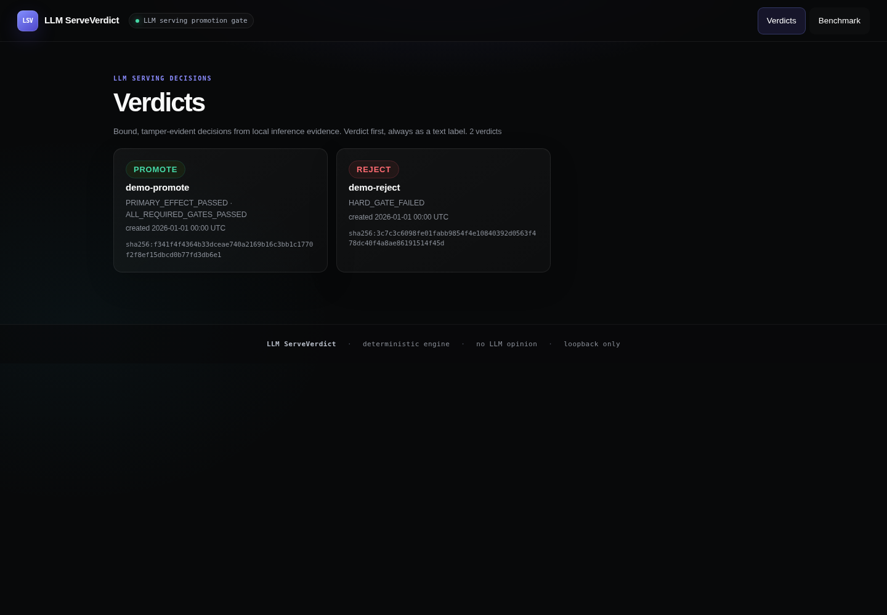
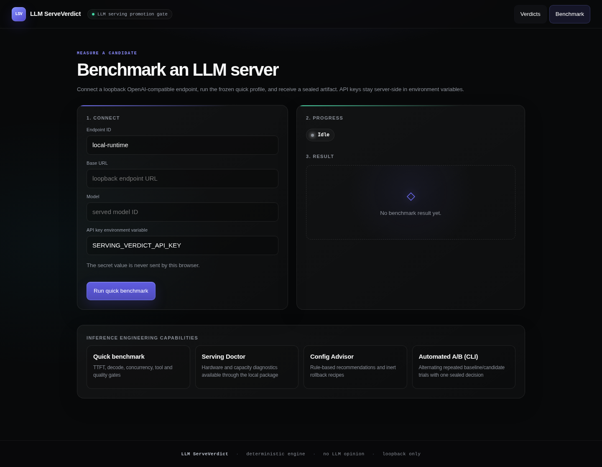
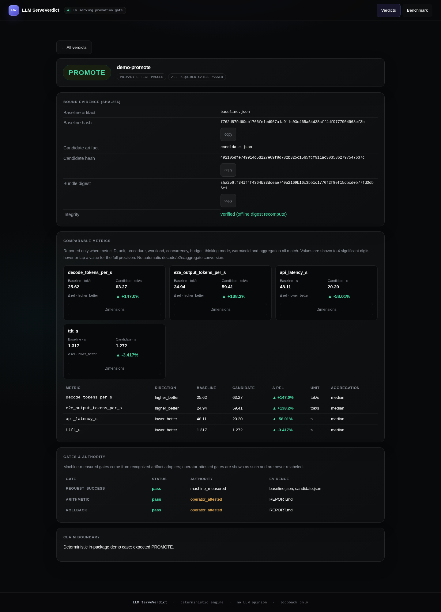
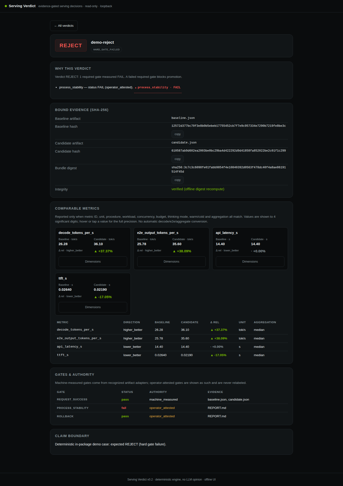
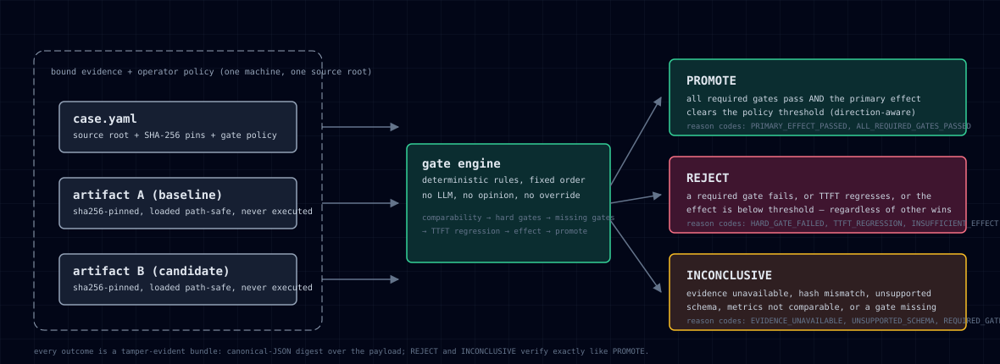
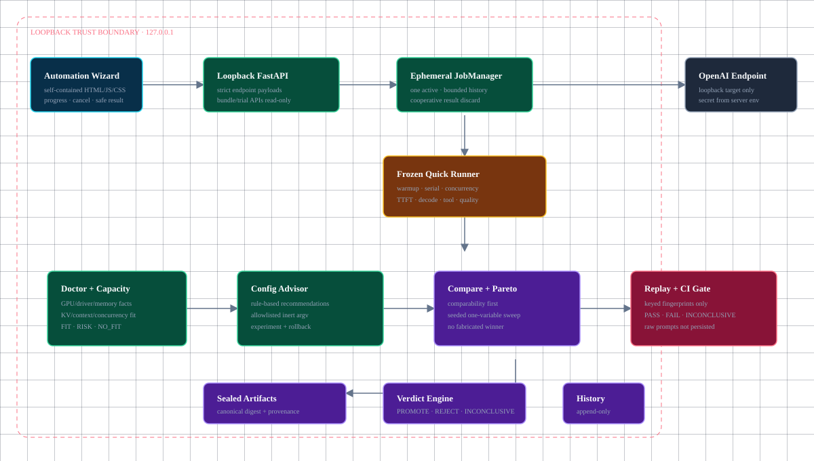
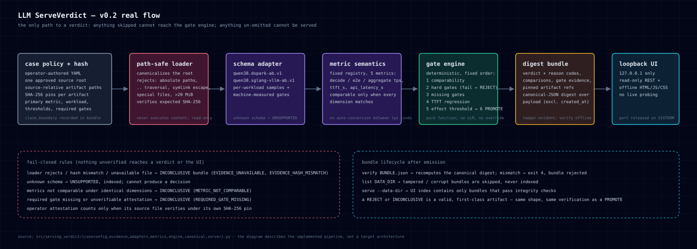

# Serving Verdict

**Stop averaging your way into production.** Serving Verdict turns bound
benchmark evidence — exact files, pinned SHA-256, operator-authored policy —
into one deterministic, tamper-evident decision: `PROMOTE`, `REJECT`, or
`INCONCLUSIVE`. No dashboard to scroll, no LLM opinion, no "it's probably
fine."

A throughput win that fails the process-stability gate is a `REJECT`. A
candidate that passes every required gate *and* clears the effect threshold
is a `PROMOTE`. Everything else is `INCONCLUSIVE`, and that answer is a
first-class, digested, verifiable artifact — not an error you have to
re-litigate.





## Why this exists

Inference teams regularly change serving configurations: runtime versions,
quantization, speculative decoding, batching, context limits, prefix caching,
and GPU memory settings. A candidate can look faster in one benchmark while
quietly breaking tool calls, increasing time-to-first-token, or crashing under
the real application workload.

Serving Verdict answers one operational question:

> **Should this inference change replace the current configuration?**

It turns separately produced measurements and test evidence into a release
gate. Performance improvement is necessary only when the policy says it is;
required correctness and stability gates always win. A fast candidate with a
failed hard gate is `REJECT`, not a misleading green benchmark chart.

## Business value

| Without Serving Verdict | With Serving Verdict |
|---|---|
| Results are spread across logs, JSON files, spreadsheets, and chat messages. | One tamper-evident bundle binds the policy, exact evidence hashes, metrics, gates, and decision. |
| Engineers manually decide whether a speed gain is worth a reliability regression. | Deterministic rules return `PROMOTE`, `REJECT`, or `INCONCLUSIVE` in a fixed, reviewable order. |
| A synthetic throughput win can be promoted before production-specific failures are noticed. | Tool, correctness, stability, TTFT, and evidence-integrity gates can block the promotion. |
| The reason for an old serving decision is difficult to reconstruct. | Append-only trial history and offline verification preserve what was decided and why. |
| Teams repeat comparison methodology differently for every runtime change. | Metric semantics and comparability dimensions make the decision process repeatable. |

This reduces review time and the risk of deploying an inference optimization
that is faster but operationally worse. It does **not** calculate financial
savings or guarantee production reliability; it makes the evidence and policy
behind the decision explicit and reproducible.

## Who uses it

- Inference and performance engineers evaluating vLLM, SGLang, llama.cpp, or
  another serving stack.
- MLOps/platform teams reviewing runtime upgrades and GPU configuration changes.
- Local-LLM users comparing quantization, speculative decoding, cache, batch,
  and context settings.
- Researchers who need a reproducible record of why a measured candidate was
  accepted or rejected.

## How it fits the workflow

```text
1. Connect a loopback OpenAI-compatible endpoint and run the frozen quick profile.
2. Diagnose hardware/capacity constraints and generate safe one-variable experiments.
3. Compare baseline and candidate artifacts under hard quality and stability gates.
4. Inspect evidence, recommendations, Pareto trade-offs, and rollback recipes.
5. Replay privacy-redacted workloads in CI and verify sealed decisions offline.
```

v0.3 includes a built-in OpenAI-compatible quick benchmark runner and a local
Automation Wizard. It sends bounded frozen requests only to an operator-selected
loopback endpoint; it never starts, stops, or reconfigures a model server. API
keys remain environment-only, and automation artifacts preserve the same
fail-closed decision contract.

## 30-second demo

```bash
uv sync --extra dev
uv run serving-verdict demo --out-dir demo      # runs both bundled fixture cases
uv run serving-verdict list demo                 # both verdicts, one JSON object
uv run serving-verdict verify demo/demo-promote.verdict.json
uv run serving-verdict verify demo/demo-reject.verdict.json
uv run serving-verdict serve --host 127.0.0.1 --port 8787 --data-dir demo
# open http://127.0.0.1:8787
```

`demo` is the portable path: it runs the two fixture cases that ship with the
repository (self-contained, no access to any external source tree required),
writes one verdict bundle per case under `--out-dir`, and exits `0` when all
bundles are valid. The two fixture cases are chosen to exercise both sides of
the decision surface — and both sides are first-class:

| fixture | verdict | why |
|---|---|---|
| `demo-promote` | `PROMOTE` | synthetic effect gain clears the threshold and every required gate passes |
| `demo-reject` | `REJECT` | synthetic throughput win is overridden by a failed `process_stability` gate |

A `REJECT` is a success of the tool, not a failure of it. Both bundles verify
offline with the same command, and neither is more "interesting" than the
other: they are the same kind of object with different verdicts.

| PROMOTE detail | REJECT detail |
|---|---|
|  |  |



## What it is

- **Case policy + hash** — operator-authored YAML binds exact source-relative
  artifact paths and SHA-256 hashes under one approved source root.
- **Path-safe evidence loader** — canonicalizes the root, rejects absolute
  child paths, `..` traversal, symlink escape, special files, and >20 MiB
  files. It never executes artifact content.
- **Schema adapters** — two recognized artifact schemas
  (`qwen38.dspark-ab.v1`, `qwen38.sglang-vllm-ab.v1`); unknown schemas are
  indexed as `UNSUPPORTED` and cannot produce a decision.
- **Metric semantic registry** — `decode_tokens_per_s`,
  `e2e_output_tokens_per_s`, `aggregate_output_tokens_per_s`, `ttft_s`,
  `api_latency_s` have fixed semantics; two values are comparable only when
  every semantic dimension matches.
- **Deterministic gate engine** — pure function of bound evidence + policy,
  evaluated in a fixed rule order (hard gates before effect, TTFT regression
  before promote). No LLM participates.
- **Tamper-evident digest bundle** — canonical-JSON digest over the payload
  (excluding the volatile `created_at` and the digest field itself);
  re-verifyable offline.
- **Loopback product UI** — self-contained HTML/JS/CSS on `127.0.0.1`.
  Evidence/trial APIs stay read-only; bounded automation jobs are ephemeral.
- **Inference engineering toolkit** — quick benchmark, Doctor/Capacity, Config
  Advisor, compare/sweep/Pareto, privacy-safe replay and CI regression gates.



An interactive version with summary cards is available in
[architecture-v0.3.html](docs/architecture-v0.3.html).

The evidence/verdict compatibility core remains:



The real flow, left to right:
**case policy + hash → path-safe loader → schema adapter → metric semantics →
gate engine → digest bundle → loopback UI.** There is no other path to a
verdict: anything not loaded through the path-safe loader and recognized by a
schema adapter cannot reach the gate engine, and anything the gate engine does
not emit cannot be served.

## What it is not

- Not a GPU dashboard, and not a monitoring system.
- Not a stress/load-testing platform: the quick profile sends a small, frozen,
  bounded workload only to an explicitly selected loopback endpoint.
- Not a runtime manager: it never starts, stops, or configures a server,
  container, or accelerator.
- Not a generic benchmark comparator: only the two recognized artifact
  schemas above are authoritative; every other schema is `UNSUPPORTED` by
  design.
- Not an opinion: there is no model in the verdict path, no free-text
  justification field, and no override that flips a `REJECT` to `PROMOTE`.
- Not a security scanner, and not a compliance tool.

## Honest test matrix and claim boundaries

What is actually exercised, as of this tree:

| claim | status |
|---|---|
| Decision engine rule order, comparability, direction-aware effect gate | covered by unit tests (`tests/test_engine.py`) |
| Path-safe loader (traversal, symlink escape, size bound, special files) | covered by unit tests (`tests/test_evidence_loader.py`) |
| Canonical digest (determinism, NaN rejection, mutation sensitivity) | covered by unit tests (`tests/test_canonical.py`) |
| Both artifact adapters against minimized fixtures | covered by unit tests (`tests/test_adapters.py`) |
| CLI exit codes, `--json` contract, loopback server E2E (incl. port release on SIGTERM) | covered by tests (`tests/test_cli.py`, `tests/test_server.py`, `tests/test_ui_dom.py`) |
| Benchmark/Doctor/Advisor/Compare/Sweep/Pareto/Replay/Automation contracts | covered by the corresponding module E2E and adversarial tests; 619 tests pass in a fresh clone |
| CI matrix: Linux + macOS, Python 3.11 + 3.12 (pytest, ruff, mypy, build) | green in GitHub Actions, including portable demo/history tests and wheel import |
| `demo` command and fixture-portable quickstart | exercised by `tests/test_demo_v02.py` and `tests/test_cli_v02.py` |
| Windows | **not** tested and **not** supported in v0.3 |
| The two real-world case configs under `configs/cases/` | bind absolute source-tree paths on one machine (see Advanced); not reproducible from a fresh checkout |

Claim boundary: **a Serving Verdict verdict is a claim about the bound
artifacts, on the machine and source tree that produced them, under the
operator's policy.** It is not a claim about the model's quality in general,
nor about any workload not covered by the bound evidence. Bundles that fail
integrity verification are excluded from the index and UI by design
(fail-closed).

## CLI

```text
serving-verdict demo --out-dir DIR [--json]
serving-verdict import-case CASE.yaml --out BUNDLE.json [--source-root DIR] [--archive DIR] [--json]
serving-verdict verify BUNDLE.json [--archive] [--json]
serving-verdict list DATA_DIR [--json]
serving-verdict show BUNDLE.json [--json]
serving-verdict history [DATA_DIR] [--json]
serving-verdict reindex [DATA_DIR] [--json]
serving-verdict endpoint check ENDPOINT.yaml [--json]
serving-verdict bench run --endpoint ENDPOINT.yaml --profile quick --out RUN.json [--json]
serving-verdict serve --host 127.0.0.1 --port 8787 --data-dir DATA_DIR
```

Exit codes:

| code | meaning |
|---|---|
| `0` | command succeeded; `verify` passed; `import` produced any valid verdict (incl. `REJECT`/`INCONCLUSIVE`) |
| `2` | usage/config/load error where no valid bundle can be produced |
| `4` | bundle integrity verification failure |

`--json` emits exactly one JSON object on stdout; diagnostics go to stderr.

## HTTP / UI

- `GET /api/v1/health`, `GET /api/v1/ready`, `GET /api/v1/verdicts`,
  `GET /api/v1/verdicts/{case_id}`, `GET /api/v1/trials`,
  `GET /api/v1/trials/{case_id}`, `GET /api/v1/artifacts/{sha}`,
  `GET /api/v1/metrics`, `GET /api/v1/automation/capabilities`, and `GET /`.
- `POST /api/v1/automation/jobs` starts one bounded ephemeral quick run;
  `GET /api/v1/automation/jobs/{id}` polls it and `POST .../{id}/cancel`
  requests cooperative cancellation with result discard.
- Loopback-only (`127.0.0.1`); any other host is rejected at startup.
- Bundle, trial, and artifact APIs remain read-only. Automation POST routes only
  create bounded in-memory jobs; they never mutate the data directory or runtime.

## Quality gates

```bash
uv run pytest -q
uv run ruff check src tests
uv run mypy src
uv build
```

## Repository layout

```
src/serving_verdict/     package (CLI, engine, API, UI assets)
configs/cases/           operator-authored case configs (bind real source hashes)
tests/                   unit + integration + E2E tests, with minimized fixtures
docs/                    tdd-journal.md, diagrams, and supporting notes
```

## Security invariants

Never executes artifact content, never invokes a shell or Docker, never
accepts a user-provided source root over HTTP (the CLI case config is the
only source-root input), canonicalizes and constrains paths, bounds file size
to 20 MiB, rejects symlink escape and special files, keeps evidence APIs
read-only, bounds automation jobs in memory, and releases the port on shutdown.
Report vulnerabilities via
[SECURITY.md](SECURITY.md) — not via a public issue.

## Advanced: running the real cases

The shipped `configs/cases/*.yaml` files bind an **absolute source root on a
specific machine** (`/home/ozkangu/Desktop/Qwen3.8-27B-DGX-Spark-RTX-6000`)
because case configs are deliberately opinionated about *which bytes* are
evidence. On another machine those exact imports will produce
`INCONCLUSIVE` bundles (`EVIDENCE_UNAVAILABLE`) — that is the loader working,
not a bug. To run real cases of your own:

1. Author a `case.yaml` with `source_root` pointing at *your* source tree and
   `sha256` pins computed against the exact artifact files.
2. `uv run serving-verdict import-case your-case.yaml --out data/your-case.verdict.json`
3. Verify, then serve or archive the bundle.

The `demo` command is the supported, portable substitute for steps 1–2 when
you do not yet have your own bound source tree.

## License

MIT. See [LICENSE](LICENSE).
