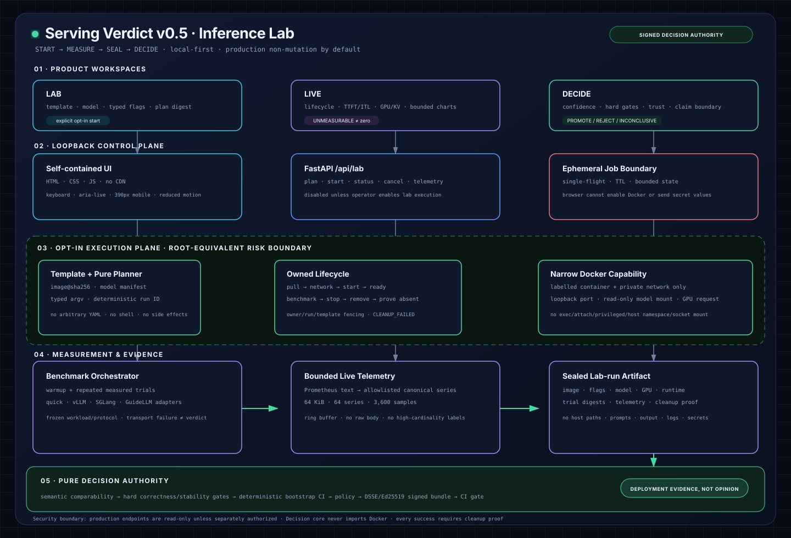

<div align="center">

# Serving Verdict

### From inference experiment to signed promotion decision.

**Benchmark reports tell you what was faster. Serving Verdict decides whether the exact candidate is safe and sufficiently evidenced to replace the baseline.**

[](https://github.com/ozkangrk/serving-verdict/actions/workflows/ci.yaml)
[](https://github.com/ozkangrk/serving-verdict/releases)
[](https://github.com/ozkangrk/serving-verdict/actions)
[](LICENSE)

`PROMOTE` · `REJECT` · `INCONCLUSIVE`

No LLM opinion in the verdict path. No silent metric conversion. No promotion from an unverified bundle.

</div>



## The problem

An inference configuration can win a throughput benchmark and still be the
wrong production change:

- TTFT or tail latency regressed;
- tool calls or structured output broke;
- the process became unstable;
- workload, model, runtime or metric semantics no longer match;
- the apparent gain is smaller than benchmark noise;
- evidence or provenance cannot be trusted.

Serving Verdict turns those conditions into a deterministic, reviewable release
gate. Hard correctness and stability gates override speed. Missing, incompatible,
statistically weak or untrusted evidence yields `INCONCLUSIVE` instead of a guess.

## See it in 60 seconds

```bash
git clone https://github.com/ozkangrk/serving-verdict.git
cd serving-verdict
uv sync --extra dev

uv run serving-verdict demo --out-dir demo
uv run serving-verdict verify demo/demo-promote.verdict.json
uv run serving-verdict verify demo/demo-reject.verdict.json
uv run serving-verdict serve --host 127.0.0.1 --port 8787 --data-dir demo
```

Open [http://127.0.0.1:8787](http://127.0.0.1:8787).

| PROMOTE | REJECT |
|---|---|
|  |  |

Both are successful tool outcomes. Both are sealed artifacts. Both verify offline.

## One product loop

```text
Connect / import evidence
        ↓
Freeze workload, protocol, runtime, model and policy identity
        ↓
Compare baseline vs candidate under hard gates
        ↓
Estimate repeated-trial effect and confidence
        ↓
Bind evidence manifest + structured claim boundary
        ↓
PROMOTE / REJECT / INCONCLUSIVE
        ↓
Sign, verify and enforce in CI
```

The opt-in **Inference Lab** workstream extends the upstream half of this loop:

```text
Select digest-pinned vLLM / SGLang / llama.cpp template
→ plan without side effects
→ disposable owned runtime
→ repeated benchmark + bounded live telemetry
→ prove cleanup
→ seal evidence
→ use the same pure decision authority
```

Inference Lab is under active v0.5 development. The decision, statistics,
adapter, signing and CI-gate foundations are implemented on the v0.4 integration
line; Docker execution remains opt-in and does not mutate production by default.

## What makes it different

| Existing layer | What it already does well | Serving Verdict's role |
|---|---|---|
| vLLM/SGLang/llama.cpp | Serve models efficiently | Bind exact runtime/image/flags/model identity |
| GuideLLM/AIPerf/inference-perf | Generate rich benchmark evidence | Normalize without inventing missing semantics |
| Prometheus/Grafana/OTel | Observe live systems | Seal a bounded evidence window, not replace the TSDB |
| KServe/llm-d/Dynamo/SkyPilot | Deploy, route and scale | Decide whether evidence authorizes promotion |
| Sigstore/SLSA/DSSE primitives | Establish build/artifact trust | Bind trust to the inference promotion decision |

The durable wedge is **decision authority**, not another runtime, load generator
or dashboard. See the point-in-time [competitor reconnaissance](docs/COMPETITOR_RECON_2026-08-20.md).

## Implemented foundations

### Evidence and decisions

- deterministic fixed-order gate engine;
- path-safe, bounded, non-executing evidence loader;
- explicit metric units, directions, procedures and comparability dimensions;
- correctness, tool, stability, TTFT and required-evidence hard gates;
- sealed bundles and offline integrity verification;
- append-only history and content-addressed evidence archive.

### Inference engineering

- bounded OpenAI-compatible quick benchmark;
- endpoint preflight and environment-only credentials;
- Serving Doctor and capacity planner;
- rule-based Config Advisor with inert launch/rollback recipes;
- baseline/candidate compare, one-variable sweep and Pareto frontier;
- privacy-safe workload replay and CI regression contracts;
- bounded ephemeral Automation Wizard.

### v0.4 trust and ecosystem foundation

- repeated-trial statistical model;
- deterministic seeded bootstrap confidence intervals;
- explicit insufficient-sample and statistical-uncertainty outcomes;
- structured bundle v0.4 claim boundary and evidence manifest;
- offline DSSE + Ed25519 verdict signing;
- strict local trust store and `verify --require-signature`;
- formal immutable adapter SDK;
- experimental strict adapters for vLLM, SGLang and GuideLLM;
- stable CI promotion-gate contract and composite GitHub Action;
- CodeQL, dependency audit, secret scan, checksums and build provenance workflows.

### v0.5 Inference Lab foundation

- approved [normative runtime contract](docs/INFERENCE_LAB_SPEC.md);
- digest-pinned inert runtime templates and typed pure planner;
- bounded Prometheus-text telemetry normalization and ring buffer;
- owned lifecycle state machine with cancellation, cleanup fencing and
  `CLEANUP_FAILED` terminal semantics.

These foundations do not yet claim a shipped production Docker control plane.
Real Docker/GPU E2E, Lab/Live/Decide APIs and final UI remain v0.5 release gates.

## Trust model in one minute

A verdict is a claim about **these exact bytes, semantics and conditions** — not
about a model in general.

- Imported evidence is identified by SHA-256.
- Unknown schemas and incompatible metrics cannot silently participate.
- Warmup and measured trials are distinct.
- Performance cannot override required correctness/stability gates.
- Statistical eligibility is not itself promotion.
- v0.4 digest coverage binds the issuance time, producer, evidence manifest,
  policy result and structured claim boundary.
- A required signature must verify against an allowed local key and signer.
- Private keys and endpoint API keys remain environment-only.
- The first signature backend is offline DSSE + Ed25519; it does **not** claim
  Sigstore transparency, OIDC identity, revocation or timestamp authority.

Read [THREAT_MODEL.md](THREAT_MODEL.md), [SECURITY.md](SECURITY.md) and the
[bundle/signing contract](docs/BUNDLE_SCHEMA.md).

## CLI highlights

```text
serving-verdict demo --out-dir DIR
serving-verdict endpoint check ENDPOINT.yaml
serving-verdict bench run --endpoint ENDPOINT.yaml --profile quick --out RUN.json
serving-verdict import-case CASE.yaml --out VERDICT.json
serving-verdict verify VERDICT.json [--require-signature --trust-store TRUST.json]
serving-verdict sign VERDICT_V04.json --key-env ENV --signer ID --out SIGNED.json
serving-verdict gate VERDICT.json --require PROMOTE --fail-inconclusive
serving-verdict serve --host 127.0.0.1 --port 8787 --data-dir DIR
```

Stable automation-facing commands emit one JSON object on stdout and diagnostics
on stderr. Integrity/signature failures are distinct from usage failures and
valid negative verdicts. See [CI integration](docs/CI_INTEGRATION.md).

## Current UI


The UI is self-contained HTML/JS/CSS served only on loopback. It has no CDN or
Node runtime dependency. Evidence/history APIs are read-only; automation state
is bounded and ephemeral. The v0.5 productization target is a redesigned
**Lab / Live / Decide** workspace with real-browser desktop and 390px release
screenshots.

## Documentation

| Document | Purpose |
|---|---|
| [PRD v0.4 → v1.0](docs/PRD-v0.4-v1.0.md) | Product direction and acceptance contracts |
| [Inference Lab spec](docs/INFERENCE_LAB_SPEC.md) | Opt-in runtime, benchmark, telemetry and UI contract |
| [Architecture v0.5](docs/architecture-v0.5.html) | Full visual architecture |
| [Statistics](docs/STATISTICS.md) | Exact repeated-trial/bootstrap semantics and limits |
| [Bundle schema](docs/BUNDLE_SCHEMA.md) | Digest, manifest, DSSE and trust-store contract |
| [Adapters](docs/ADAPTERS.md) | Adapter interface, support matrix and upstream citations |
| [CI integration](docs/CI_INTEGRATION.md) | Exit codes, JSON contract and GitHub Action |
| [Threat model](THREAT_MODEL.md) | Attacker model, mitigations and residual risk |
| [Release process](RELEASE.md) | Checksums, attestations and operator gates |

## Development gates

```bash
uv run pytest -q
uv run ruff check src tests scripts
uv run mypy src
uv build
```

The release process additionally validates workflow YAML/action pinning, runs
fresh-clone gates, real browser E2E, desktop/mobile overflow checks, secret scans
and an independent exact-tree adversarial review. Unresolved HIGH or MEDIUM
findings block merge.

## Explicit non-goals

- no LLM in the verdict path;
- no arbitrary shell, uploaded Compose YAML or untrusted artifact execution;
- no generic Kubernetes platform, gateway, scheduler or persistent TSDB;
- no automatic production mutation in the current release line;
- no claim that one benchmark proves universal model/runtime superiority;
- no conversion of missing telemetry into zero or false certainty.

## Project status

- Latest public release: [`v0.3.0`](https://github.com/ozkangrk/serving-verdict/releases/tag/v0.3.0)
- v0.4: statistics, signing, adapters, CI/security integration in final integration
- v0.5: safe Inference Lab foundations in active development
- PyPI trusted publishing: intentionally not configured yet
- Supported CI matrix: Linux/macOS, Python 3.11/3.12
- Windows: not currently claimed as supported

## Contributing and security

Contributions are welcome, especially adapter fixtures, policy edge cases and
runtime-template proposals with authoritative upstream provenance. Read
[CONTRIBUTING.md](CONTRIBUTING.md) before opening a PR.

Report vulnerabilities privately according to [SECURITY.md](SECURITY.md).

## License

MIT © Serving Verdict contributors.
