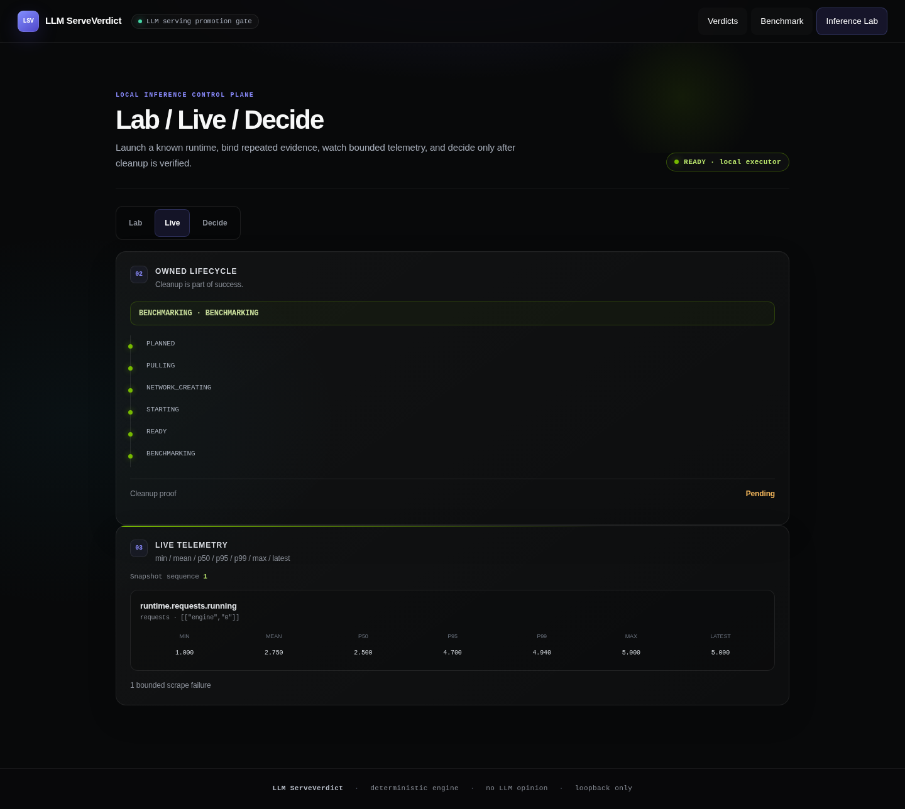
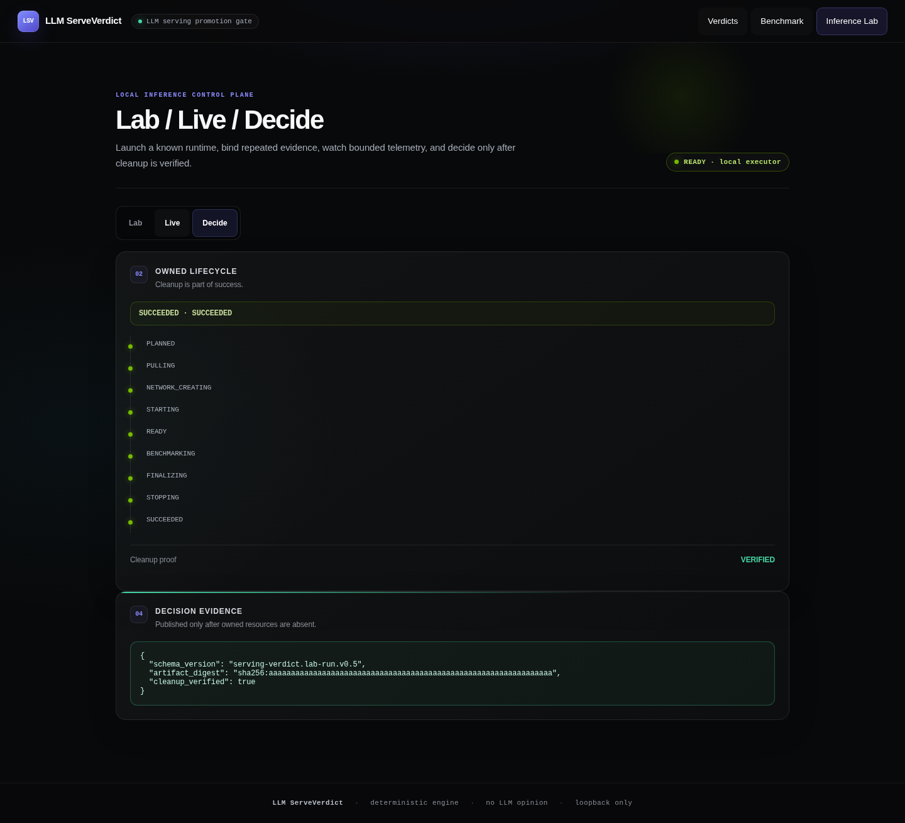

# Lab / Live / Decide UI

The Inference Lab workspace is a self-contained, offline browser surface over the
bounded `/api/v1/lab/*` state model.

## Workspace

### Lab

- built-in runtime template selection: vLLM, SGLang, llama.cpp;
- relative model reference;
- typed engine overrides only;
- repeated-trial and deterministic seed controls;
- bounded telemetry interval/sample controls;
- explicit start and cleanup/cancel actions.

There are deliberately no fields for an image, argv, entrypoint, mount,
environment variable, API key or Docker socket.

### Live

- exact owned lifecycle timeline;
- active state and cleanup proof;
- bounded snapshot sequence;
- per-series min, mean, p50, p95, p99, max and latest;
- fixed-category scrape failure count.

The UI renders normalized API data with `textContent`; raw Prometheus bodies,
runtime exceptions and secrets are not rendered.

### Decide

A result is visible only when the Lab job is `SUCCEEDED` and cleanup is verified.
`CANCELLED`, `FAILED` and `CLEANUP_FAILED` never render a promotion-eligible
artifact.

## Capability state

The default server has no Lab executor, so the workspace renders a clear disabled
operator gate and disables Start. Browser input cannot enable Docker access.

## Design language

- Linear-style near-black luminance hierarchy and precise data density;
- restrained NVIDIA `#76b900` signal for runtime/readiness telemetry;
- indigo reserved for navigation and primary interaction;
- local system font stack and no CDN;
- minimum 44px controls;
- responsive 1440px and 390px layouts;
- no page-level horizontal overflow;
- reduced-motion rules inherited from the existing UI contract.

## Browser evidence

The screenshots below were captured from the real FastAPI, LabJobManager and
shipped JavaScript. A trusted deterministic injected executor produced the state
transitions and normalized telemetry. They prove the UI/API state contract, **not
a real GPU benchmark**. Real vLLM/SGLang Docker screenshots remain the final
GPU-dogfood gate.

Measured browser checks for desktop and 390px mobile:

- console errors: 0;
- horizontal overflow: 0px;
- visible button targets below 44px: 0;
- 9px Live statistic labels: ≥4.5:1 WCAG AA on the lightest modeled card surface;
- success result shown only with `cleanup_verified: true`;
- displayed telemetry: mean `2.750`, p95 `4.700` from the injected sample set.
